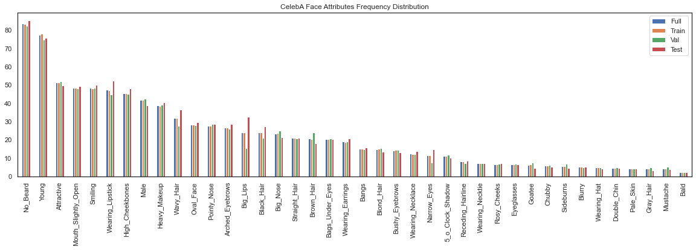
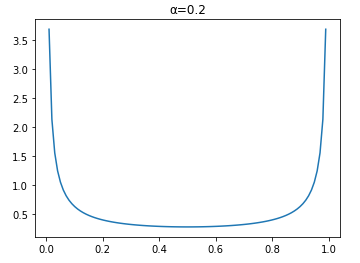

## Foreword

This was a memorable project for me as I had the opportunity to seek and try out numerous advanced machine learning techniques to improve my classification model.

My final model was designed to use pre-trained ImageNet **MobileNetV2** weights with 40 multi-head binary classifiers. To account for the dataset imbalance issue, **MixUp** training was performed and the **Focal loss** function was used.

## Problem Statement

The objective of this challenge is to build a high performance multi-label classifier for face attributes classification using a given dataset. The evaluation set is released one week prior to submission deadline. The higher the prediction accuracy obtained for the private testset, the higher the grades for this challenge.

There are some **constraints** set for this challenge:
- Model should be trained strictly on the trainset of CelebA.  
- Only ImageNet pre-trained models are allowed.
- Ensemble of models is not allowed.

The **deliverables** of this challenge include:
- A short report in pdf format of not more than five A4 pages.
- Predictions of the test set in a text file.
- Source codes for training and testing the model.

## Dataset
### CelebA

The dataset used is from [CelebA](http://mmlab.ie.cuhk.edu.hk/projects/CelebA.html) which contains 200 thousand cropped and aligned faces. The dataset is split into 162,770 images for training, 19,867 images for validation and 19,962 images for testing. There are a total of 40 binary attributes (labels) for each image, with 1 indicating positive prediction, while -1 indicates negative prediction. These attributes are often used to describe a face and some examples include black hair, smiling, mustache. Given an aligned facial image, the classifier must output its prediction for all 40 attributes, making this a multi-label classification problem.

### Exploratory Data Analysis (EDA)

Prior to building the model, EDA was performed to better analyze the given dataset. The frequency distribution of the labels of each dataset split is plotted using matplotlib.

The plot shows the following observations:
+ The splits looked to be stratified sampled for train and validation sets.
+ The test set has some attributes sampled more frequently (e.g. Wearing Lipstick, Wavy Hair and Big Lips).
+ The full dataset is **highly imbalanced** with:
  + Common attributes like No Beard and Young weighing above 70%.
  + Less than 5% of rare attributes such as Mustache and Bald.

Further EDA process also found the following issues:
+ Multiple mislabelled images such as:
  + Mislabelled males as females with Male set to -1.
  + Mislabelled females with No_Beard set to -1.
+ 131 duplicated images with 99 of them having different attribute annotations.

Other things to note:
+ Some attribute labels such as "Attractive" is rather subjective.
+ Train set contains images with annotations, but without faces.

See my codes on:
+ CelebA EDA: <a href="https://github.com/kkaryl/AI6126-Advanced_Computer_Vision/blob/master/project_1/src/EDA_Celeba.ipynb"><i class="fab fa-github"></i> Github</a>
+ CelebA Duplicate Check: <a href="https://github.com/kkaryl/AI6126-Advanced_Computer_Vision/blob/master/project_1/src/EDA_Check_Duplicates.ipynb"><i class="fab fa-github"></i> Github</a>

## Implementation

### Data Augmentation
Data augmentation is an important step in many computer vision tasks due to the scarcity of labelled dataset. It helps to “increase” the training set by creating variations of the original images. This expanded dataset alleviates the problem of overfitting and allows the model to generalize better.

For the train set, the images are center cropped to 198 × 158 with 50% probability of horizontal flip and 50% probability for affine transformations (shift, scale, rotate), before RGB normalization and conversion to tensors. For the validation and test set, the images are center cropped to 198 × 158 before RGB normalization and conversion to tensor.

See my test codes on data augmentations at:
<a href="https://github.com/kkaryl/AI6126-Advanced_Computer_Vision/blob/master/project_1/src/DA_Test%20Transforms.ipynb"><i class="fab fa-github"></i> Github</a>

### MixUp Training

As recommended by He et al. in their Bag of Tricks paper, MixUp training is an alternate form data augmentation technique. In the training loop, pairs of images in a batch are interpolated using a λ value sampled from a beta distribution of α = 0.2 (hyperparameter). The training loss is also computed using a weighted (λ) linear combination of the two losses calculated from the two labels of the mixed images.

See my test codes on MixUp training at:
<a href="https://github.com/kkaryl/AI6126-Advanced_Computer_Vision/blob/master/project_1/src/DA_MixUp%20Testing.ipynb"><i class="fab fa-github"></i> Github</a>

### Focal loss

$$\begin{align}
CE(p_t) &= -log(p_t) \\\\\\
FL(p_t) &= -\alpha (1-p_t)^{\gamma} log (p_t)
\end{align}$$

Due to the class imbalance problem of the dataset stated in EDA, there are more easy positives like No Beard than hard positives like Gray Hair. As a result, the model might tend to be biased towards learning more representations of the data-dominated class. Hence, by using Focal Loss (Equation 2) over Cross Entropy Loss (Equation 1), it can help the network to learn sparse hard examples better. The hyperparameter α controls the weights of positive and negative samples, while γ adjusts the rate at which easy examples are downweighted. After some empirical tuning, α = 0.25 and γ = 3 were set.

### Results
My best model was trained using pre-trained ImageNet MobileNetV2 as backbone with 40 binary classifiers for identifying the attributes. It attained average accuracy of 91.55%, 92.28% and 91.71% on CelebA's train, validation and test set respectively.

After the release of the grades, the source of the private test set was announced to be from [lfwA+](http://vis-www.cs.umass.edu/lfw/). My submission obtained a grade of **25**/**25**.

See my training notebook at: <a href="https://github.com/kkaryl/AI6126-Advanced_Computer_Vision/blob/master/project_1/src/ai6126-p1-train-v1.5.ipynb"><i class="fab fa-github"></i> Github</a>

See my inference notebook at: <a href="https://github.com/kkaryl/AI6126-Advanced_Computer_Vision/blob/master/project_1/src/ai6126-p1-inference-v0.3.ipynb"><i class="fab fa-github"></i> Github</a>

## End Notes
Here's a list of other techniques I've tried, but did not improve my model:
+ Some data augmentations like:
    + ColorJitter
    + FancyPCA
    + Random brightness and contrast
    + Adding of random Gaussian noise
+ Random Erasing did not work well with MixUp training
+ Label Smoothing
+ Other backbone models like: ResNet50, ResNeXt50

### Random Erasing
Random Erasing is like dropout at input level. It cuts out randomly sized areas from random locations of the images with random probability. Much like image impainting, it makes it harder for the classifer to learn by hiding certain semantics from it.

### Label Smoothing
Label smoothing is a regularization technique by Szegedy et al., which perturbs the target variables, to make the model less confident of its predictions. It does so by performing a weighted linear combination of predicted values by an $\epsilon$ value e.g. 0.1. It usually performs well on imbalanced datasets.
