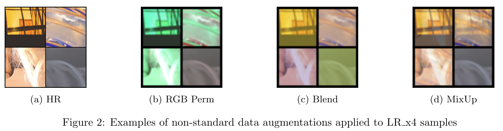
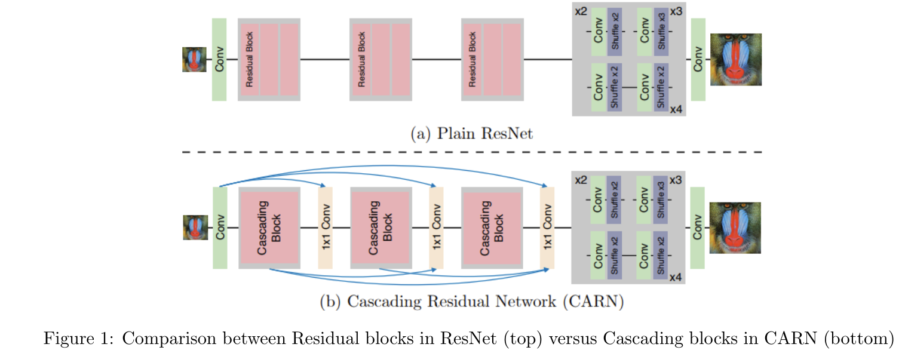

## Foreword

Single image super-resolution (SISR) aims to recover a high-resolution (HR) image from its low-resolution(LR) observation. There are two major challenges to project namely the constraint on the number of trainable parameters of the model and the long training times due to the large sizes of the HR images.

The former constraint restricts the use of GANs, which is known to produce higher fidelity images as additional discriminator network will definitely exceed the number of trainable parameters. Due to limited computational resources, training a SISR model on a shared GPU resource provided by the institution took too much time per training iteration. This problem was alleviated by converting the raw images into subimages and stored in lmdb format, which allowed much faster disk IO. However, it will still take an entire day to train 1 million iterations. This limits the amount of empirical tuning during the model training and thus forces students to seek out the most efficient and effective methods to try.

My final model was designed to use a modified version of SRResNet (MSRResNet) trained on a mini-DIV2K dataset with numerous data augmentations such as MixUp training and L1 loss. It achieved a PSNR score on 28.99 on the validation set after 2M iterations.

## Problem Statement

The objective of this challenge is to build a high performing light-weight neural network model that can increase the resolution of a single image (by four times) using a given dataset.  The evaluation set (80 test images) is released one week prior to submission deadline. The higher the PSNR obtained for the private testset, the higher the grades for this challenge.

There are some **constraints** set for this challenge:
- Model should be trained strictly on the provided mini DIV2K training set.  
- Model should contain fewer than 1,821,085 trainable parameters, which is 120% of the trainable parameters in SRResNet.
- No external data and pretrained models are allowed.
- Ensemble of models is not allowed.

The **deliverables** of this challenge include:
- A short report in pdf format of not more than five A4 pages.
  - PSNR of model on validation sets
  - Number of parameters of final model
- The four times upscaled images of the 80 test LR images.
- Model checkpoint (weights) of submitted model.
- Source codes for training and testing the model.

## Dataset
### Mini DIV2K

The mini dataset provided was extracted from the larger [DIV2K](https://data.vision.ee.ethz.ch/cvl/DIV2K/) dataset, which originally contains 800 HR and corresponding low resolution images for training and 100 HR and LR images for validation. In this project, the mini DIV2K dataset contains 500 HR and LRx4 images for training and 80 pairs for validation and will be hereafter denoted as DIV2K for simplicity.

### Dataset Preparation
As the DIV2K training dataset contains large 2K images, it takes a long time to load the HR images into memory for training. In order to improve the speed of disk IO during training, the 500 HR images are first cropped into 20,424 of 480x480 subimages before converting into a lmdb dataset (HRsub.lmdb) format. Similarly, the 500 corresponding LR images are also cropped into 20,424 of 120x120 subimages before converting to a lmdb dataset (LRx4sub.lmdb).

One thing to note is the disadvantage for converting the images into lmdb format. The two lmdb files required close to 70 GB of disk space as compared to the original 3GB of all the image files. However, it is a necessary tradeoff to train using the lmdb files as the training speed was increased at least 2 folds.

## Implementation

### Data Augmentation
Data augmentation is an important step in many computer vision tasks due to the scarcity of labelled dataset. It helps to “increase” the training set by creating variations of the original images. This expanded dataset alleviates the problem of overfitting and allows the model to generalize better.

Standard geometric manipulation techniques such as paired random crop, random horizontal and vertical flips and random rotations, provided by the baseline BasicSR are applied to the model training.

Inspired by Yoo et al. findings on effective augmentations for Image Super Resolution, augmentations such as RGB permutations and Blending, which performs no structural changes to the images were applied. RGB permutation is the random shuffling of the color channels of the HR and LR images (same permutations), while Blending adds a random constant value to the images. As experimented, these two augmentation improves the PSNR by 0.03 on the validation set. Futhermore, MixUp training was also performed. MixUp is a data augmentation technique that blends two images to generate an unseen training sample. As such pairs of LR and HR images are mixed together using a weighted linear interpolation with a λ value sampled from a beta distribution of α = 0.2 (hyperparameter).  

### L1 loss

$$\begin{align}
L1 &= \frac{1}{N} \sum_{i=1}^N |I_{HR}(i) - I_{SR}(i)|
\end{align}$$

As the PSNR metric is highly correlated with the pixel-wise difference, and minimizing the pixel loss directly maximizes the PSNR metric value. It was observed that L1 Loss performs better than MSE Loss in terms of PSNR on validation set, thus it was used for the training of the final model.

### Evaluation Metric

$$\begin{align}
MSE &= \frac{1}{N} \sum_{i=1}^N (I_{HR}(i) - I_{SR}(i))^2 \\\\\\
PSNR &= 10 \cdot \log_{10}(\frac{L^2}{MSE})
\end{align}$$

For this challenge, the evaluation metric used is the Peak Signal-to-Noise Ratio (PSNR) score. PSNR is inversely proportional to the logarithm of the Mean Squared Error (MSE) between the ground truth image and the generated image.

### Results
My final model uses MSRResNet (Modified SRResNet) with 20 residual blocks has a total of **1,812,995** parameters, trained using standard geometric augmentations, RGB permutation, Blend and MixUp augmentations obtained a PSNR score of **28.99** in Mini-DIV2k test set after 2 million training iterations. This modified version of SRResNet uses residual blocks without Batch Normalization, which is an enhancement suggested in the EDSR paper. The MSRResNet was configured to use 20 residual blocks instead of the original 16 blocks to increase its depth and it is strictly within the trainable parameters of 1,821,085.

Note that the final grades for this challenge was not released as it was a final project, but it can be assumed that my submission was one of the top-performing candidates based on my final results for the course.

<!-- See my training notebook at: <a href="https://github.com/kkaryl/AI6126-Advanced_Computer_Vision/blob/master/project_1/src/ai6126-p1-train-v1.5.ipynb"><i class="fab fa-github"></i> Github</a>

See my inference notebook at: <a href="https://github.com/kkaryl/AI6126-Advanced_Computer_Vision/blob/master/project_1/src/ai6126-p1-inference-v0.3.ipynb"><i class="fab fa-github"></i> Github</a> -->

## End Notes
Here's a list of other techniques I've tried, but did not improve my model:
+ Some data augmentations like:
  + CutBlur
  + Random brightness and contrast
+ Other model architectures such as:
  + EDSR
  + CARN

### CARN Architecture

The CARN model is based on ResNet architecture like the baseline, SRResNet. The main difference between CARN and ResNet is the presence of local and global cascading modules.  In the CARN model, each residual block is changed to a “local” cascading block and the blue arrows indicate “global” cascading connections. The outputs of intermediary layers are cascaded into the higher layers, and finally converge on a single 1×1 convolution layer.
