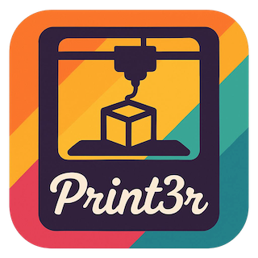
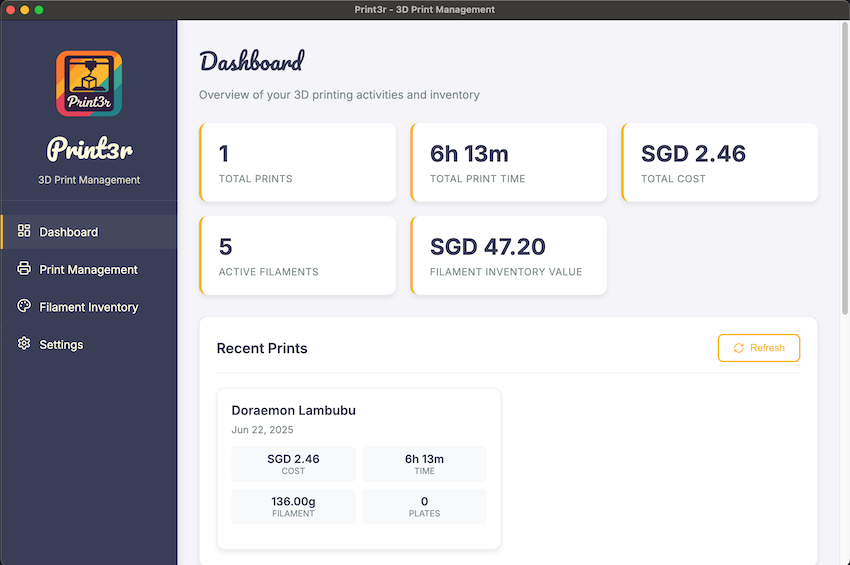
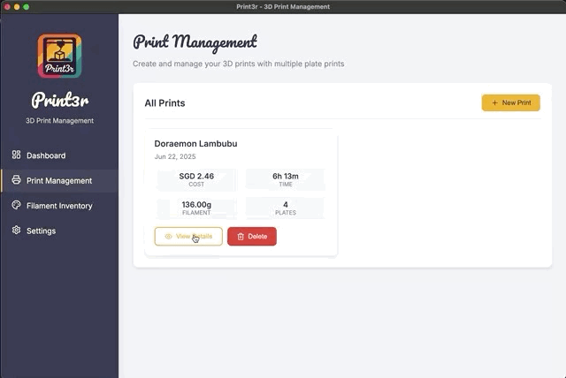
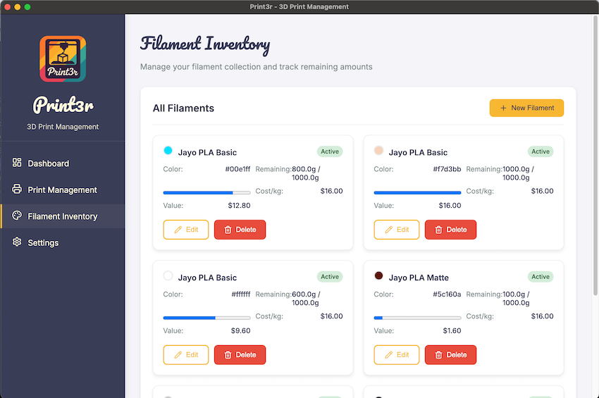

## Introduction

I've recently dived headfirst into the world of 3D printing, and while it's been an incredibly rewarding hobby, I quickly found myself drowning in a sea of details. 
Keeping track of what I've printed, how much filament each model consumed (especially across multiple plates), and the actual cost of it all became a chaotic mess of forgotten notes. 
I needed a better way to manage my prints, my filaments and cost.

So, I built **Print3r**, a custom desktop application to bring order to my 3D printing chaos. 😵‍💫

## The Why: A Need for Organized Printing

As my collection of prints and filaments grew, so did the mess. 

-   How much did that multi-plate model *actually* cost to print?
-   How much of my favorite PLA+ filament do I have left?
-   What's the total cost of all the parts for my latest project?

I needed a centralized place to store print histories, manage my filament inventory, and calculate the true cost of each print, right down to the electricity used.

## The Solution: Print3r

Print3r is a dedicated tool designed to solve these problems. It's built with Electron, making it a neat, self-contained desktop app. Here's what it does:

### Dashboard Overview

### Print History

Every print is logged with its history, giving me a complete overview of my projects. 
I'm also able to record multiple build plate prints in a single print model record.

### Granular Filament & Cost Tracking

This is the core of Print3r. I can catalog my entire filament inventory, including:
-   **Brand**: Bambulab or 3rd Party brands
-   **Material**: PLA Basic, PLA+, PLA Matte, High Speed PLA—you name it.
-   **Price**: I input the cost of each spool, which is then used for cost calculations.

The app meticulously tracks filament usage for each print, even when a model is split across multiple plates.
 It then combines the filament cost with the electricity cost (based on configurable rates and print time) to give me a precise total price for every single model.

## A 6-Hour Sprint with Cursor

One of the most exciting parts of this project was how quickly it came together. Using Cursor, I went from idea to a fully functional Electron application in just **6 hours**. 
The AI-assisted workflow allowed me to focus on the logic and features without getting bogged down in boilerplate code. 

## Conclusion

Building Print3r will become a great companion to my 3D printing hobby. 
It brings a level of organization and insight that I was missing, allowing me to focus more on the fun part of printing.

This project was a fun, fast-paced "build-to-learn" project that helped to solve a real-life headache of mine.

The source code is available on [GitHub](https://github.com/kkaryl/print3r).

---

This post is part of my Build to Learn series, where I explore new technologies and development approaches through hands-on projects. 