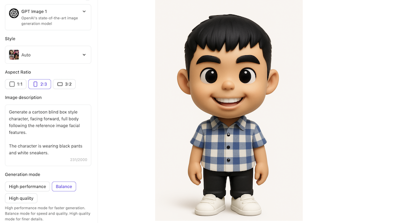
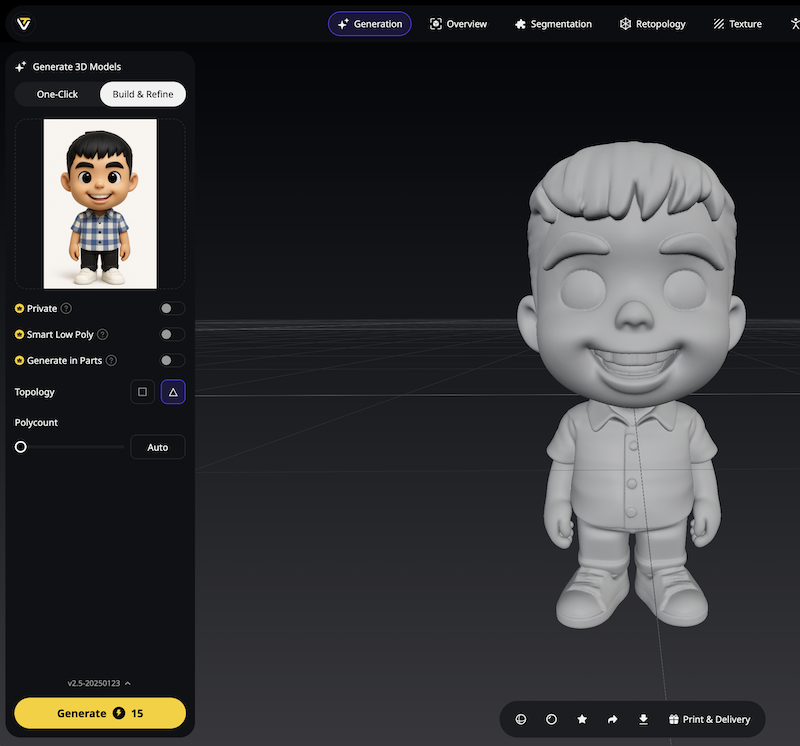
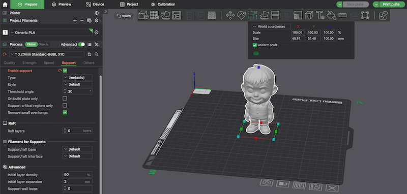
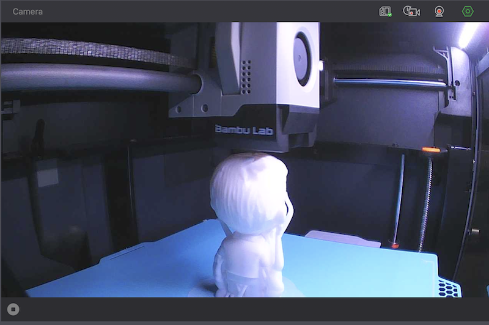

## Introduction

There's something magical about watching an idea materialize from thin air into something you can hold in your hands. 
As someone who's passionate about building and creating, I've always been drawn to the moment when the intangible becomes tangible – whether it's code transforming into a working application or, in this case, a simple photograph becoming a physical 3D figurine.

When I got my hands on a Bambu Lab 3D printer recently (thanks to some serious inspiration from a close friend), 
I thought my weekend hobby time would be limited to printing random models from MakerWorld. 
After all, I had zero 3D modeling skills, and learning Blender or Fusion 360 seemed like a mountain I wasn't ready to climb.
But then life presented me with the perfect challenge: a departing team member who deserved something special. 
Someone who'd worked closely with me, deserves a farewell gift that went beyond the typical coffee mug or gift card. 
What better way to honor our collaboration than with something I'd built myself?

That's when it hit me – could I "make" him a personalized 3D figurine with generative AI?  
Alas, here's the process of how I turned a simple photograph into a tangible keepsake, and what I learned along the way.

## The Process of Photo to Figurine

### Step 1: Transforming Reality into Character Art

The first challenge was clear: I didn't want to print a realistic miniature of my colleague (that would be slightly creepy, right?). 
Instead, I envisioned something cute and approachable – a chibi-style figurine of him that would be able to place whereever he wants.

I started with a clear reference photo and started crafting a prompt that would transform the realistic photo into something print-friendly.
Here's the final prompt I used:

```
Generate a cartoon blind box style character, facing forward, full body following the reference image facial features.

The character is wearing black pants and white sneakers.

Include fine details, 3D rendering, white background.
```



>> **Pro tip**: The simpler your character design, the cleaner your 3D model will be. 
Complex details that look great in 2D often become printing nightmares in 3D.

### Step 2: From 2D Art to 3D Reality

With my character image ready, I needed to bridge the gap between flat artwork and a printable 3D model. 
After researching various image-to-3D services, I settled on Tripo3D.ai for its simplicity and generous free credits for newcomers.



The process couldn't have been more straightforward: upload the character image, click generate, and wait. 
A few moments later, the AI intelligently created a model that looked genuinely printable. 
I exported it as a .3mf file and moved to the final step.

### Step 3: From Pixels to Physical

Opening the model in Bambu Studio felt like the final piece of the puzzle clicking into place. 
I enabled supports (essential for any figurine with overhangs), scaled it to desk-appropriate size, and hit print!



In 1 hour and 51 minutes, after 500 layers of printing, the personalized figurine came to life! 



^ Image from my 3D printer while I type my blog post

## Reflections and Lessons Learned

### What Worked Brilliantly

**Speed and Accessibility**: The entire process, from concept to finished print, took less than a day. No weeks of learning 3D modeling software, no frustrating attempts at digital sculpting – just AI-powered creativity and modern 3D printing working in harmony.

**Quality Results**: The final figurine captured the personality I was aiming for and the print quality was impressive for an AI-generated model.

**Low Barrier to Entry**: This workflow democratizes 3D creation. Anyone with a photo and access to AI tools can now create personalized 3D objects without technical expertise.

### The Trade-offs

**Limited Customization**: While the AI did an excellent job with the basic transformation, I couldn't add personal touches like his name on the shirt or specific details that would have made it even more special.

**Monochrome Limitations**: The printed figurine came out in single-color plastic. Adding paint would require additional skills and time I wasn't prepared to invest.

**Less Creative Control**: Traditional 3D modeling would have given me complete control over every detail. With AI generation, I was somewhat at the mercy of the algorithm's interpretation.

---

## Update After 2 Months (Why this post was delayed)

I was genuinely excited about my first foray into AI-generated 3D printing and I had this entire blog post drafted the day after printing that figurine in June.
However, this post was published 2 months after the initial draft. 
The reason was because as someone with semi-perfectionist tendencies, I couldn't shake the feeling that the results, while impressive, weren't quite what I had envisioned.

Rather than letting that initial experience define my 3D printing journey, I decided to dive deeper into the hobby. 
These past two months have been filled with weekend experiments, failures, and breakthroughs that have kept me thoroughly engaged.

### New Skills Acquired

> Spoiler Alert: No, I still do not know how to 3D model using Blender.

One of the most satisfying discoveries was learning to add color to my originally monochrome prints using BambuStudio's paint tool. 
What seemed like a limitation in my initial AI-generated workflow turned out to be just another skill to acquire. 
The ability to selectively color different parts of a model during slicing opened up entirely new creative possibilities.

Perhaps more importantly, I've become intimately familiar with my 3D printer itself. 
After dealing with several print failures (ah, the dreaded spaghetti monster nightmares!), I found myself dismantling various components to diagnose issues. 
What initially felt intimidating became empowering. There's something deeply satisfying about understanding your tools at a mechanical level, and now I approach potential print problems with more confidence rather than pure frustration.

### AI Modeling Reality Check
I also experimented with Blender MCP, hoping to "prompt" my way to better 3D models. The results were... educational. 
Let's just say that the time and tokens invested didn't yield results that justified the effort. 
Nonetheless, I'm still satisfied to give the tool a try, maybe with time, it would get better.

### Conclusion 2.0: Rediscovering the Joy of Hands-On Learning

What strikes me most about this journey is how it reminded me of day-to-day traditional software engineering. 
That hands-on, trial-and-error approach to understanding systems. The debugging mindset. The satisfaction of crafting something that works through iteration and experimentation.

I know my recent posts have been heavily focused on 3D printing, but technically, I'm still doing "machine" learning in a very literal sense! 
As someone who's never considered themselves particularly handy with physical objects, this hobby has been a delightful surprise. 
It turns out there's something universally appealing about the process of taking an idea, working through the technical challenges, and ending up with something tangible you can hold in your hands.

The AI-generated figurine project was just the beginning. 
It got me through the door, but the real learning happened in the months that followed.
